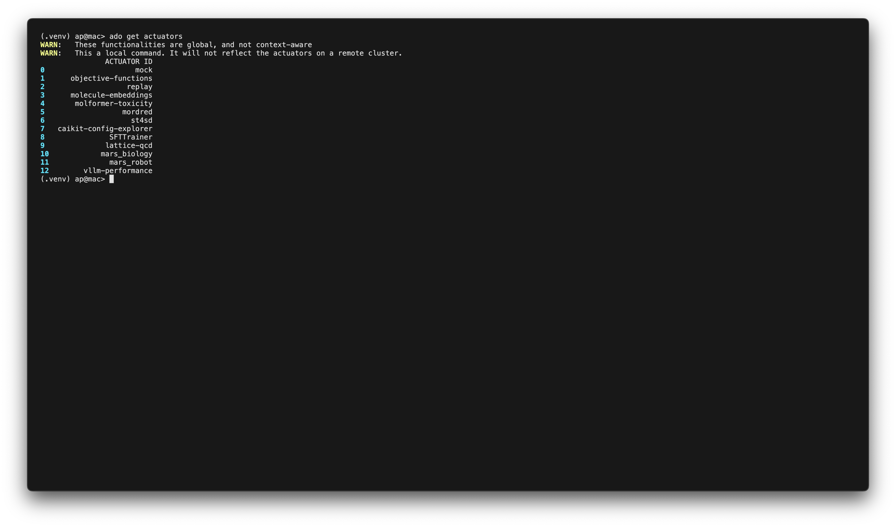

## About

This is the repo for the **a**ccelerated **d**iscovery **o**rchestrator (**ado**).

**ado** is a unified platform for **executing computational experiments at scale** and **analysing their results**.
It can be easily extended with new experiments or new analysis tools. 
It allows distributed teams of researchers and engineers to collaborate on projects, execute experiments, and share data.

An analogy for **ado** is that it is like kubernetes but for scientific data.

**ado** is targeted at users who are familiar with command line tools. Users familiar with `kubectl` or `oc` will notice
many parallels.

For extension **ado** targets users familiar with python development.

## Key Features

* :scroll: *Declarative*: No need for programming unless you want to. Everything can be done via YAML.
* :computer: *CLI*: Our human-centric CLI follows [best practices](https://clig.dev).
* :handshake: *Projects*: Allow distributed groups of users to collaborate and share data.
* :electric_plug: *Extendable*: Easily add new experiments, optimizers or other tools.
* :gear: *Scalable*: We use [ray](https://ray.io) as our execution engine allowing experiments and tools to easily
  scale.
* :recycle: *Automatic data-reuse*: Avoid repeating work with transparent reuse of experiment results. `ado` internal
  protocols ensure this happens only when it makes sense.
* :link: *Provenance*: As you work, the relationship between the data you create and operations you perform are
  automatically tracked.
* :mag: *Optimization and sampling*: Out-of-the-box, leverage powerful optimization methods via `raytune` or use our
  flexible in built sampler.

### Foundation Model Experimentation

We provide a number of packages with experiments for testing foundation-models:

* :stopwatch: fine-tuning performance benchmarking (built on SFTTrainer)
* :stopwatch: inference performance benchmarking (built on vLLM perf)
* **COMING SOON** :test_tube: quality evaluation benchmarking (built on lm-evaluation-harness)
* **COMING SOON** :crystal_ball: inference and fine-tuning prediction (built on ARISE and sklearn)

## Developers!

With `ado` you can avoid having to (re)implement features like data-tracking, data-sharing and tool integration for your
specific domain and instead get them for free.

## Requirements

A basic installation of ado only requires a recent Python version (3.10+) and it enables you to run many of our examples and explore ado features.

### Additional Requirements

Some advanced features have extra requirements:
* Distributed Projects (Optional): To support projects with multiple users you will need a remote, accessible, MySQL database. See [here](backend/mysql/README.md#using-the-distributed-mysql-backend-for-ado) for more
* Multi-Node Execution (Optional): To support multi-node or scaling execution you may need a multi-node RayCluster. See [here](backend/kuberay/README.md#deploying-kuberay-and-creating-a-raycluster) for more details

In addition `ado` plugins may have additional requirements for realistic runs. For example,
* Fine-Tuning Benchmarking (SFTTrainer): Requires a remote RayCluster with GPUs
* vLLM Performance Benchmarking (vllm_performance): Requires a remote OpenShift cluster with GPUs
 
## Install

To install you can execute the following (we recommend you set up a virtual environment)
```commandline
git clone https://github.com/IBM/ado.git
cd ado
pip install .
```

Alternate instructions to install `ado` can be found
here: https://ibm.github.io/ado/getting-started/install/

## Development

Instructions for developing ado are available in [DEVELOPING](DEVELOPING.md).

### Testing

To run unit-tests read [tests/README.md](tests/README.md).

## Example

This video shows listing [actuators](website/docs/actuators/working-with-actuators.md) and getting the details of an experiment.

[](website/docs/getting-started/videos/step1_trimmed.mp4)


## Technical Report

For more details on the Discovery Spaces concept underlying ado, please refer to this [technical report](https://arxiv.org/abs/2506.21467)
