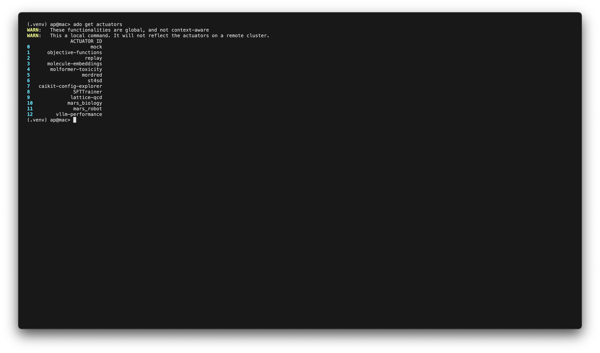

# Introduction

[](https://doi.org/10.21105/joss.10304)

This is the repository for the **a**ccelerated **d**iscovery **o**rchestrator
(**`ado`**).

**`ado`** is a Python platform for **designing experiment campaigns and
executing them at scale**. It enables distributed teams of researchers and
engineers to collaborate, execute experiments, and share data.

You can extend ado across different domains through its **plugin model**-often
as simple as decorating a Python function. By integrating
your methodology, you gain cross-cutting capabilities—such as
**parallel execution**, **data provenance**, and a **unified CLI**—alongside a structured
foundation that allows AI coding agents to **autonomously formulate and run your
experiments**.

🧑‍💻 Using **`ado`** assumes familiarity with command line tools.

🛠️ Developing **`ado`** requires knowledge of python.

## Key Features

- 💻 _CLI_: Our human-centric
  CLI follows [best practices](https://clig.dev)
- 🤝 _Projects_: Allow distributed groups of users to
  [collaborate and share data](https://ibm.github.io/ado/resources/metastore.md)
- 🔌 _Extendable_: Easily
  [add new experiments](https://ibm.github.io/ado/actuators/creating-custom-experiments.md),
  [optimizers or other tools.](https://ibm.github.io/ado/operators/creating-operators.md)
- ⚙️ _Scalable_: We use [ray](https://ray.io) as our execution engine
  allowing experiments and tools to easily scale
- ♻️ _Automatic data-reuse_: Avoid repeating work with
  [transparent reuse of experiment results](https://ibm.github.io/ado/core-concepts/data-sharing.md).
`ado` internal protocols ensure this happens only when it makes sense
- 🔗 _Provenance_: As you work, the relationship between the data you create
  and operations you perform are
  [automatically tracked](https://ibm.github.io/ado/getting-started/ado.md#ado-show-related)
- 🔎 _Optimization and sampling_: Out-of-the-box, leverage powerful
  optimization methods [via `raytune`](operators/optimisation-with-ray-tune.md)
  or use our [flexible in built sampler](https://ibm.github.io/ado/operators/random-walk.md)
- 🤖 _Coding agents_: Supercharge your workflow. `ado`'s
  typed resources and bundled skills enable AI assistants to autonomously
  formulate, validate, and run experiments. [Learn more](https://ibm.github.io/ado/how-to/).

### Foundation Model Experimentation

We have developed `ado` plugins providing advanced capabilities for performance
testing of foundation-models:

- ⏱️[fine-tuning performance benchmarking](https://ibm.github.io/ado/actuators/sft-trainer)
- ⏱️
  [inference performance benchmarking](https://ibm.github.io/ado/examples/vllm-performance-endpoint.md)
  (using [vLLM bench](https://docs.vllm.ai/en/latest/cli/bench/serve.html) or
  [guidellm](https://github.com/vllm-project/guidellm))
- 🔮[predictive performance models creation](https://ibm.github.io/ado/operators/trim.md)

## Requirements

A basic installation of `ado` only requires a recent Python version (3.10 to
3.13). This will allow you to run
[many of our examples](https://ibm.github.io/ado/examples/examples)
and explore ado features.

### Additional Requirements

Some advanced features have additional requirements:

<!-- markdownlint-disable descriptive-link-text -->
- **Distributed Projects** **_(Optional)_**: To support projects with multiple
  users you will need a remote, accessible, MySQL database. See
  [here](https://ibm.github.io/ado/getting-started/installing-backend-services#using-the-distributed-mysql-backend-for-ado)
  for more
- **Multi-Node Execution** **_(Optional)_**: To support multi-node or scaling
  execution you may need a multi-node RayCluster. See
  [here](https://ibm.github.io/ado/getting-started/installing-backend-services#deploying-kuberay-and-creating-a-raycluster)
  for more details
<!-- markdownlint-enable descriptive-link-text -->

In addition `ado` plugins may have additional requirements for executing
**_realistic_** experiments. For example,

- **_Fine-Tuning Benchmarking_**: Requires a
  [RayCluster with GPUs](https://ibm.github.io/ado/actuators/sft-trainer#configure-your-raycluster)
- **_vLLM Performance Benchmarking_**: Requires an OpenShift cluster with GPUs

## Install

To install you can execute the following (we recommend you set up a virtual
environment)

```commandline
git clone https://github.com/IBM/ado.git
cd ado
pip install .
```

Alternate instructions to install `ado` can be found here:
<https://ibm.github.io/ado/getting-started/install/>

## Development

Instructions for developing ado are available in [DEVELOPING](DEVELOPING.md).

### Testing

To run unit-tests read [tests/README.md](tests/README.md).

## Example

This video shows listing
[actuators](website/docs/actuators/working-with-actuators.md) and getting the
details of an experiment.

Check [demo](https://ibm.github.io/ado/getting-started/demo) for more videos.

[](https://github.com/user-attachments/assets/fc4862f3-763b-4967-ab3c-4bd359900a50)

## Citation

For an overview of the design and architecture of `ado`, see
[our Journal of Open Source Software paper.](https://doi.org/10.21105/joss.10304)

If `ado` has been helpful in your research, please cite us using:

```bibtex
@article{Johnston_ado_a_Python_2026,
author = {Johnston, Michael A. and Pomponio, Alessandro},
doi = {10.21105/joss.10304},
journal = {Journal of Open Source Software},
month = may,
number = {121},
pages = {10304},
title = {{ado: a Python framework for computational experimentation and benchmarking}},
url = {https://joss.theoj.org/papers/10.21105/joss.10304},
volume = {11},
year = {2026}
}
```

You can also click "Cite this repository" in the GitHub sidebar
for alternative formats like APA.

## Acknowledgement

This project is partially funded by the European Union through the Smart
Networks and Services Joint Undertaking (SNS JU) under grant agreement No.
101192750 (Project 6G-DALI).
